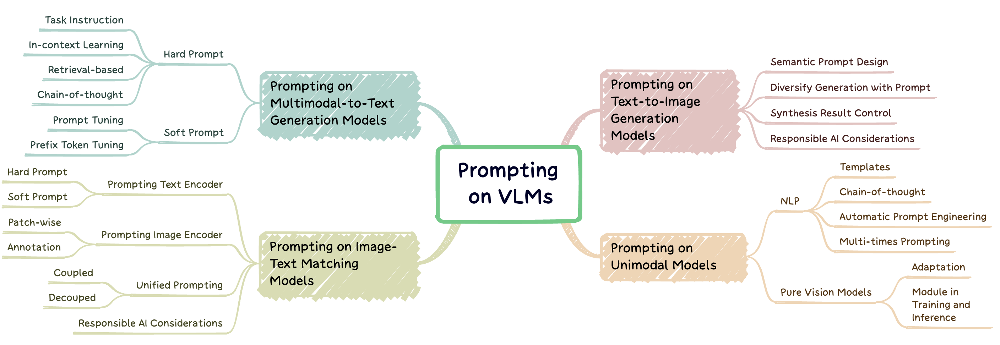
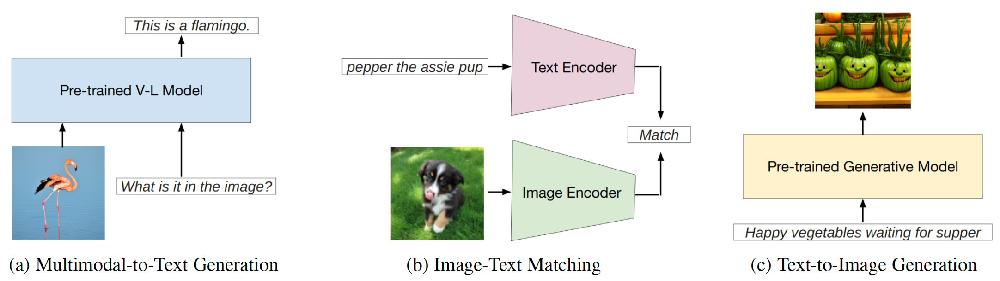
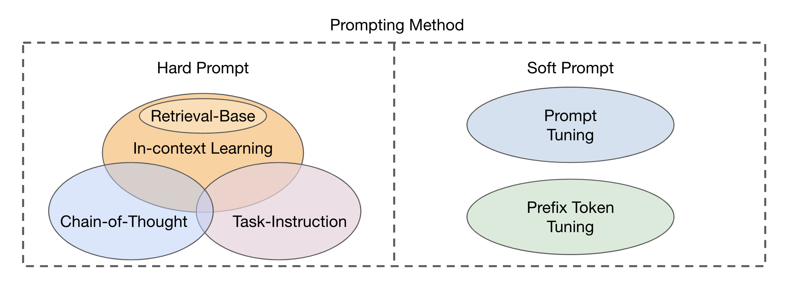
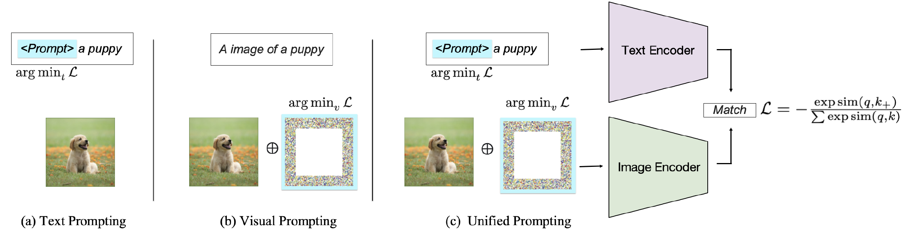

# Awesome Prompting on Vision-Language Models


## # :nerd_face: What is Prompting on Vision-Language Models?
Prompt engineering is a technique that involves augmenting a large pre-trained model with task-specific hints, known as prompts, to adapt the model to new tasks. This paper aims to provide **a comprehensive survey** of cutting-edge research in prompt engineering on **three** types of vision-language models (VLMs): **multimodal-to-text generation models** (*e.g.*, Flamingo), **image-text matching models** (*e.g.*, CLIP), and **text-to-image generation models** (*e.g.*, Stable Diffusion) (Fig. 1).



<p style="text-align:center"> <i>Fig. 1 : Three main types of vision-language models focused on this work.</ii> 		 </p>

### Reference

This repo lists relevant papers summarized in our survey: 

**A Systematic Survey of Prompt Engineering on Vision-Language Foundation Models.** *Jindong Gu, Zhen Han, Shuo Chen, Ahmad Beirami, Bailan He, Gengyuan Zhang, Ruotong Liao, Yao Qin, Volker Tresp, Philip Torr*. Preprint 2023. [[pdf]](https://scholar.google.com/citations?user=mj3ff80AAAAJ&hl=en)

If you find our paper and repo helpful to your research, please cite the following paper:
```latex
@article{gu2023survey,
  title={A Systematic Survey of Prompt Engineering on Vision-Language Foundation Models},
  author={Gu, Jindong and Han, Zhen and Chen, Shuo, and Beirami, Ahmad and He, Bailan and Zhang, Gengyuan and Liao, Ruotong and Qin, Yao and Tresp, Volker and Torr, Philip}
  journal={TBD},
  year={2023}
}
```

## # :paperclips: Awesome Papers

### Prompting Model in Multimodal-to-Text Generation (*e.g.* on Flamingo)



<p style="text-align:center"> <i>Fig. 2 : Classification of prompting methods in multimodal-to-text generation.</ii> 		 </p>


| Title | Venue | Date | Code | Tag  |
| ----- | ----- | ---- | ---- | ---- |
|       |       |      |      |      |
|       |       |      |      |      |
|       |       |      |      |      |

## Prompting Model in Image-Text Matching (*e.g.* on CLIP)



<p style="text-align:center"> <i>Fig. 2 : Classification of prompting methods on Image-Text Matching VLMs.</ii> 		 </p>


| Title | Venue | Date | Code | Tag  |
| ----- | ----- | ---- | ---- | ---- |
|       |       |      |      |      |
|       |       |      |      |      |
|       |       |      |      |      |


## Prompting Model in Text-to-Image Generation (*e.g.* on Stable Diffusion)

| Title | Venue | Date | Code | Tag  |
| ----- | ----- | ---- | ---- | ---- |
|       |       |      |      |      |
|       |       |      |      |      |
|       |       |      |      |      |


## # :mailbox_with_mail: Contact 

Please contact us (jindong.gu@outlook.com, chenshuo.cs@outlook.com) if 
- you would like to add your paper in this repo,
- you find any mistake in this repo, 
- you have any suggestion for this repo. 

